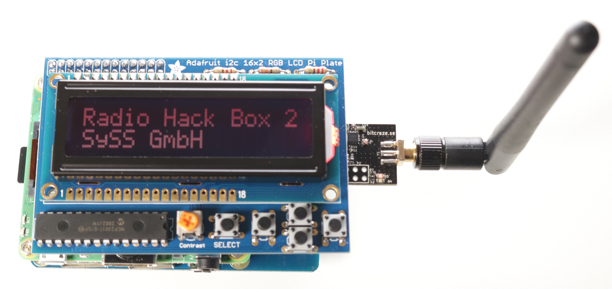

# SySS Radio Hack Box 2.0

The SySS Radio Hack Box 2.0 is a proof-of-concept software tool to demonstrate
the replay and keystroke injection vulnerabilities of the wireless keyboards
Cherry B.Unlimited AES and Cherry B.Unlimited 3.0.

It is a revision of the [SySS Radio Hack Box](https://github.com/SySS-Research/radio-hackbox/)
published in 2017.

*SySS Radio Hack Box 2*

## Requirements

- Raspberry Pi
- [Adafruit 16x2 Character LCD + Keypad for Raspberry Pi](https://learn.adafruit.com/adafruit-16x2-character-lcd-plus-keypad-for-raspberry-pi/)
- nRF24LU1+ USB radio dongle with flashed [nrf-research-firmware](https://github.com/SySS-Research/keyjector/tree/master/src) originally by the Bastille Threat Research Team and further developed by Marc Newlin, e. g.
	* [Bitcraze CrazyRadio PA USB dongle](https://www.bitcraze.io/crazyradio-pa/)
	* Logitech Unifying dongle (model C-U0007, Nordic Semiconductor based)
- Raspberry Pi power pack or a USB power bank
- [Raspberry Pi OS Lite (64 Bit)](https://www.raspberrypi.com/software/)
- Python3
- PyUSB

*SySS Radio Hack Box 2 hardware components*

## Installation

```
git clone https://git.syss.intern/mdeeg/radio-hackbox2
cd radio-hackbox2
chmod +x install.sh
sudo ./install.sh
```

## Usage

The Radio Hack Box currently has five simple push buttons for
- start/stop recording
- start playback (replay attack)
- start attack (keystroke injection attack)
- start scanning
- graceful shutdown

*SySS Radio Hack Box 2 usage*

## Demo Video

A demo video illustrating replay and keystroke injection attacks against a vulnerablie AES-encrypted wireless keyboard using the SySS Radio Hack Box 2 is available on YouTube: [SySS Radio Hack Box 2](https://www.youtube.com/watch?v=SoxOxRVpZM8)


## Disclaimer

Use at your own risk. Do not use without full consent of everyone involved.
For educational purposes only.

